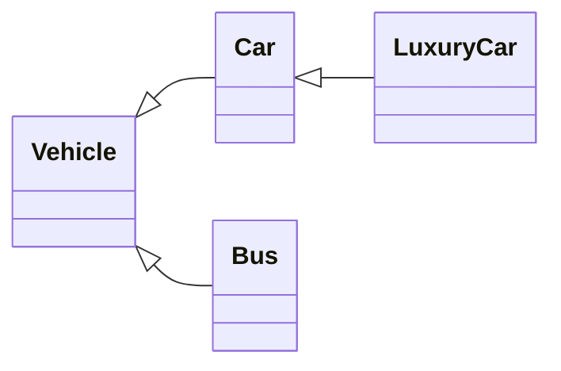
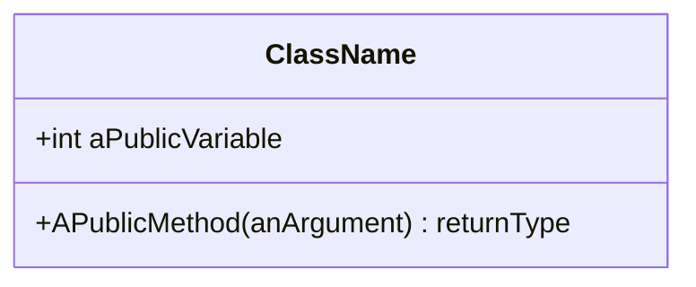
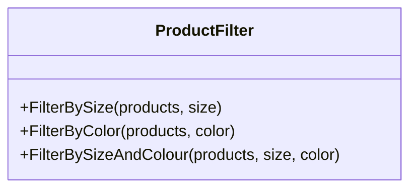
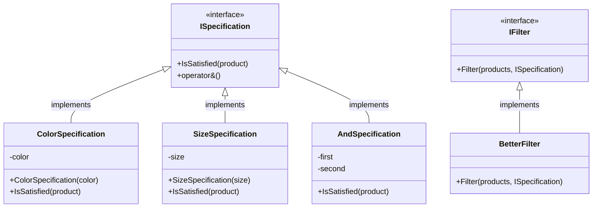

# Week 3 - OOP (Object-Oriented Programming)

[TOC]

## Procedural vs. OOP

| Procedural Programming | Object-Oriented Programmping |
|-|-|
| Data separated from functions | Combine data elements with operations on that data (data and functions are combined) |
| Lack of modularity | Better modularity - everything is self contained |
| High coupling | Low coupling |
| Re-use difficult | Re-use easier |
| Not modelling the real world - The real world doesn't have data separated from behaviour | Closely models the real world |

## The Four Pillars of OOP

### Abstraction - *I don't need to understand the engine to drive a car*

When we describe something in an abstract way (e.g. "I have a car") we have a shared understanding of what the elements are.


**A `Class` is the unit of abstraction**
: OOP Classes represent real-world things (e.g. a bag) and so have:
    - Properties (e.g. bag material, colour, size, handles)
    - Actions (e.g. put things in or remove them from the bag)


### Encapsulation - *Not how does it work, but how do I work it?*

- Each class has a well-defined responsibility

- Internal variables are hidden using `private` fields
    ```csharp
    private string _aPrivateField
    ```
    - Can create visible `get` and `set` methods
    - But can encapsulate as a Property instead
    - Properties are named using `PascalCase`
- and implementation details are hidden as the method code is not visible
    ```csharp
    private static int AnInternalMethod(int parameterOne, int parameterTwo) {}

    public int AnExternallyAvailableMethod(int parameterOne, int parameterTwo) {}
    ```
    - Provide a simple, consistent, well-defined interface to use the object
    - Methods are named using `PascalCase`


### Inheritance - *What data or methods do all objects of this type share?*

- Inheritance hierarchies represent the relationships between objects

- Base class (or Superclass) - What the derived class inherits *from*
- Derived class (or Subclass) - Inherits from the base class
    - The power of derived classes is in their ability to specialise
    - Can call methods on `base` class in derived class methods

Declare a derived class (`DerivedClass`) inheriting from a base class (`BaseClass`) 
```csharp
public class DerivedClass : BaseClass
```

Use base class constructor methods in the derived class constructor

```csharp
public Customer(string fName, string lName, int age) base(fName, lName) 
{
```
Fields in subclasses can be assigned after a reference to superclass for constructor
```csharp
    Age = age;
}
```

### Polymorphism - *Both a camera, and a gun can 'shoot'. The code doesn't need to know which you are holding*

Get a message, do something

i.e. "Start" method... couple apply to a Car, Plane, Washing Machine, Microwave, Job Application

Several kinds of objects that can deal with the same kind of message

## Implementing OOP - Classes

The use of classes encourages high cohesion, and loose coupling.
- Related functionality lives together (high cohesion).
- But a class should only have one reason to change (loose coupling).

### Classes vs. Objects
- An object is an instance of a class that we can use (and provide values for)
- A class is a type of an object

### Naming Conventions

- **Classes** - noun - PascalCase (e.g. `Person`)
- **Field** - noun - underscore using _camelCase (e.g. `_firstName`)
- **Properties** - noun - PascalCase (e.g. `FirstName`)
- **Methods** - verb - PascalCase (e.g. `GetFullName()`)
- **Variables** and method parameters - camelCase (e.g. `firstName`)
- **Constants** - const - PascalCase

### Class Composition
A class is comprised of
#### 1. **Name**
#### 2. **Data** - Class fields are declared after the *class signature* but before any *methods*.
- Private fields (`_camelCase`)
- Public Properties (`PascalCase`)
    - Assigning to a property calls its `set` method.
    - References to the property (`instance.property`) calls its `get` method.
    - Properties refer to "private backing fields" (either auto-generated or specified)
    - Can add logic to `get` and `set` (using `value`) methods.
    - Can create a property as a lambda (get only): `PropertyName => Functionality;`
    - We will only use a setter if we are setting one field at a time.
    - For two or more fields we will only have a getter.
    - Can make a `get` or `set` method internal to the class by specifying an access modifier (e.g. `Property { get; } { private set; }`) even if the property itself is `public`.
    - readonly can be set on declaration `private readonly string _hairColour = "Blonde"` or in the constructor.
    - `public const` or `private const` are set only on declaration.

##### Immutable properties

- To make a property immutable remove `set` and create a constructor that sets the value.
- OR replace `set` method with `init` and using object initializers can be specified on declaration.

#### 3. **Constructors**
|:memo: **NOTE:** If we don't specify ANY constructor then C# creates a parameterless one for us. :memo:|
|-|

- *Constructor signature*
    - Constructor is named the same as the class.
    - Does not have a return type (returns an *instance* of the `class`)
        ```csharp
        public NameOfClass()
        ```
- Constructed objects are allocated memory on the **Heap**, reference is placed on the **Stack**.
- *Parameters and default values*
    - We add parameters to the constructor to allow passing values in to the class
        ```csharp
        public Rectangle(int length, int width)
        ```
    - Can specify default values in both the constructor signature... 
        ```csharp
        public Vehicle(int capacity, int speed = 10)
        {
        ```
        ... or when defining the variables.
        ```csharp
            int numPassengers = 1;
        }
        ```
    - No hard and fast rule for when to set default values (Nish prefers to set on definition)

##### Object initializers
- `{ }` after a constructor to specify internal variables, e.g.  
```csharp
Person jim = new Person() { firstName = "Jim", secondName = "Parsons"};
```
- Can use in place of a paramaterless (default) constructor instead of having several constructors for different cases.

#### 4. **Methods**
- Define methods on the function

### UML Class diagram 
- Represents classes and the relationships between them
- Provide different levels of detail



#### Adding a Class Diagram to a project
- R-Click on the project name in **Solution Explorer**
- Choose **Add -> New Item**
- Select **Class Diagram** from the dialog box, name it (if required), and click **OK**
- Drag `.cs` files from **Solution Explorer** into the diagram.
- Changes made to the class diagram are reflected in the code (can add fields & methods through **Class Details**)

Can show full signatures by going to **Class Diagram** in the toolbar, **Change Members Format** and then **Display Full Signature**.

### Class Inheritance
 
For example, when the `Hunter` derived class inherits from the `Person` base class:
```csharp
public class Hunter : Person
```

 - Inheritance facilitates DRY
 - represents an "is-a" relationship (derived class is-a type of the base class)
 - Cannot access private member variables on the base class from an derived class
 - Can access public properties
 - Can set private member variables by calling the `base` constructor
 ```csharp
 public Hunter(string fName, string lName, string camera = " ") : base (fName, lName)
 ```
 - Derived constructor calls base constructor
 - Base constructor finishes and then runs the body of the derived constructor

 ```mermaid
 sequenceDiagram
    participant Derived
    participant Base
    activate Derived
    Note left of Derived: Derived constructor called
    Derived ->> Base: Base constructor called 
    deactivate Derived
    activate Base
    Note right of Base: Base constructor body executes
    Base ->> Derived: base body finishes
    deactivate Base
    activate Derived
    Note left of Derived: Derived constructor body executes
    deactivate Derived
    Note left of Derived: Constructed object returned
 ```
- If we want a parameterless constructor in a derived class we must also have one in the base class.
- Can call parameterless IF we refer to the base constructor in the call 
    ```csharp
    Hunter () base {"", ""}
    ```

## Structs

- For example `DateTime` is a `struct`.
- In classes you have private fields and public properties, structs have public fields.
- A struct represents one thing (e.g. a single Date and Time)
- `int` is an alias for the struct `Int32`.
- Structs can't inherit (from other structs)
- Can instantiate structs without necessarily calling constructors (i.e. no need to use `new`)
- Structs are VALUE types, not REFERENCE types.

## SOLID Principles

- Single responsibility - A class should only have one reason to change (each class should solve only one problem)
- Open/Closed - Open for extension, closed for modification (extend a class's behaviour without modifying it)
- Liskov substitution - objects of a subclass should be able to substituted in place of objects of a superclass without breaking the application
- Interface segregation - many small interfaces are better than one big one. A client object can then select which to implement (composition over inheritance).
- Dependency inversion - Depend on abstractions, not on concretions

### Single Responsibility Principle (SRP) (High cohesion, Low coupling)
"*a class or module should have one, and only one, reason to change.*" - Robert C. Martin

Separation of concerns
: different classes handling different, independent tasks/problems

Separation of concerns means:
- A class should have have one responsibility / purpose
- class members should be cohesive (related data, methods manipulate or return this data)
- should have only one reason to change

"We want our systems to be composed of many small classes, not a few large ones. Each small class encapsulates a single responsibility, has a single reason to change, and collaborates with a few others to achieve the desired system behaviors."

"Gather together the things that change for the same reasons. Separate those things that change for different reasons."

#### SRP Examples
- (ours) Moving the functionality for camera out of Hunter into its own Camera class (decoupling)
- Having seperate classes for a Journal (and its entries), and Persistence.

#### SRP Reading:
https://blog.cleancoder.com/uncle-bob/2014/05/08/SingleReponsibilityPrinciple.html

### Open / Closed Principle (OCP)
"*Software entities (classes, modules, functions, etc.) should be open for extension but closed for modification.*" - Robert C. Martin

- open for extension but closed for modification (of behaviour. Refactoring is ok)
- don't change existing classes (as they might be used and you don't know what you might be breaking)
- new functionality can be added by adding derived classes
- overriding methods in derived classes can add functionality

#### OCP Examples

Use of "Enterprise" "Specification" pattern.

Before: Violates OCP

Adding a new filter requires us to go back into `ProductFilter` to add another filtering method. **You shouldn't have to go back into existing code to add additional functionality.**

After: Respects OCP

Adding a new filter now requires us only to create a new class that implements `ISpecification` to pass to `BetterFilter`.

#### OCP Reading

### Liskov Substitution Principle (LSP) (Polymorphism)
- You should be able to substitude a base for a subtype
- Subtypes must be substitutable for their base types without breaking the application
- Must implement inherited methods in the expected ways (no surprises)
- **P**rinciple **O**f **L**east **A**stonishment (**POLA**)
- Make some things virtual so we are accessing the correct member

"You should always be able to uptype without breaking methods or their results"

#### LSP Examples

#### LSP Reading


### Interface Segregation Principle (ISP)
- Many small, specific interfaces are better than one large, general purpose one
- Classes that implement an interface don't have to implement methods they don't need.
- Interface in this context means the public methods and Properties of a code module (`abstract` or concrete C# `class`es or `interface`s)
- Interfaces can also inherit from other interfaces
```csharp
public interface IMoveable : ISingleMoveable, IMultiMoveable { }
public interface ISingleMoveable { string Move(); }
public interface IMultiMoveable {string Move(int times);}
```
- Can delegate calls to implemented methods within a class (#DecoratorPattern)
- Don't put too much into an interface; split into separate interfaces
- YAGNI - You Ain't Going to Need It


### Dependency Inversion Principle (DIP)
- Depend on abstracts rather than concrete instances
- Both high and low level modules should depend on abstractions
- High-level - Business rules, processes, guts of the application
- Low-level - Plumbing code, particularly for IO

- Hunter -> IShootable relationship is an example of Dependency Injection
- At Runtime both Hunter and Camera know nothing about each other, they both just know about the interface IShootable

- Implement an interface as an abstraction that both the high and low level modules can relate to.

- "High-level modules should not depend upon low-level ones; use abstractions"

- GUI code behind classes is low-level

### Solid Relationships
SOLID Relationships
- SRP and ISP encourage small cohesive types
- These can be extended using OSP
- ISP aids LSP and DIP
- DIP enables OSP (using Dependency Injection can extend functionality without breaking the application)

- GRASP principles
- Design Patterns
- DRY - Don't Repeat Yourself
- YAGNI - You Aren't Going To Need It
- KISS
-
- PDD - Pain-Driven Development
- Use simple techniques until they cause pain
- Then refactor when painful

Prioritising ISP and DSP supports the use of Compositional classes rather than Inheritance classes

Can add default implementation to interfaces as of C# 8

# Week 4 - Advanced NUnit Testing

## Testing Classes and Structs

- Need to instantiate a class to test the methods on it.


# Week 5 - Eng 129 - Linq & Entity Framework

## Language Integrated Query (LINQ)

We can query *any* collection.

- Queries provide an `IQueryable` interface
- `where` requires a `boolean` result so the following will fail
```csharp
var query = db.Customer.Where(CustomerId == "BONAP")
```
but this will work
```csharp
var query = db.Customer.Where(c => c.CustomerId == "BONAP")
```
This just defines the query, it is executed with an execution method, e.g. `FirstOrDefault()`:
```csharp
var selectedCustomer = query.FirstOrDefault()
```
We can carry out definition and execution in the same line
```csharp
var selectedCustomer = db.Customer.Where(c => c.CustomerId == "BONAP").FirstOrDefault()
```

## Entity Framework

### NuGet Packages Required
`Microsoft.EntityFrameworkCore`
`Microsoft.EntityFrameworkCore.SqlServer` (Allows Entity Framework Core to be used with Microsoft SQL Server(including Azure SQL Database).
`Microsoft.EntityFrameworkCore.Tools`

#### Scaffolding in PMC
`Scaffold-DbContext 'Data Source=(localdb)\MSSQLLocalDB;Initial Catalog=Northwind;Integrated Security=True;Connect Timeout=30;Encrypt=False;TrustServerCertificate=False;ApplicationIntent=ReadWrite;MultiSubnetFailover=False' Microsoft.EntityFrameworkCore.SqlServer`

- `Scaffold-DbContext` - used in the DB first approach to extrapolate the model (classes) from the database.

- `== null!` the `!` will disappear at compile time. The compiler just accepts null! to mean that it *won't* actually be null after instantiation

Scaffolding from a database using Entity Framework
https://docs.microsoft.com/en-us/ef/core/managing-schemas/scaffolding?tabs=vs

Partial classes can be defined across multiple files

https://docs.microsoft.com/en-us/dotnet/csharp/language-reference/builtin-types/nullable-value-types

Context class sits between the program and the DataBase - Represents an EndPoint for the DataBase
Builds the relationships between the Tables so that we can use them.
Uses DbSets
https://docs.microsoft.com/en-us/dotnet/api/microsoft.entityframeworkcore.dbset-1?view=efcore-6.0

Add vs AsyncAdd? Use Cases

#### region CRUD Functionality
##### READ
//foreach (var c in db.Customers)
//{
//    Console.WriteLine(c);
//}
//db.Customers.ToList().ForEach(c => Console.WriteLine(c));

##### CREATE
//var newCustomer = new Customer()
//{
//    CustomerId = "MAKSY",
//    ContactName = "Maksym Lyskov",
//    CompanyName = "SpartaGlobal"
//};
//db.Customers.Add(newCustomer);
//db.SaveChanges();
// https://docs.microsoft.com/en-us/dotnet/api/microsoft.entityframeworkcore.dbcontext.savechanges?view=efcore-6.0#microsoft-entityframeworkcore-dbcontext-savechanges

##### UPDATE
//var selectedCustomer = db.Customers.Find("MAKSY");
//selectedCustomer.City = "Kyiv";
//db.SaveChanges();

// Generally, no database interaction will be performed until SaveChanges() is called.
// 

##### DELETE
//var customerToDelete = db.Customers.Find("MAKSY");
//db.Customers.Remove(customerToDelete);
//db.SaveChanges();
#endregion

## Glossary

Class
: The unit of abstraction. Has a name, private fields, public properties, constructpors and methods. Must be instantiated before it can hold data.

Method Overloading
: Same signature but with different numbers of parameters

Object Initialization
: Specify internal variables by using `{ }` after the constructor call

Classic Model of Testing
: e.g. Assert.IsEqual...

Constraint Model of testing
: e.g. Assert.That...