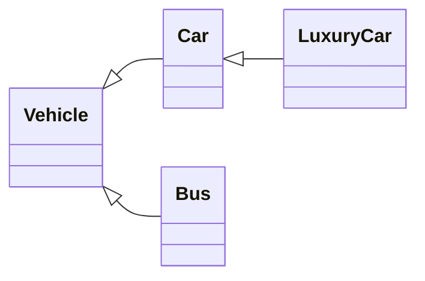
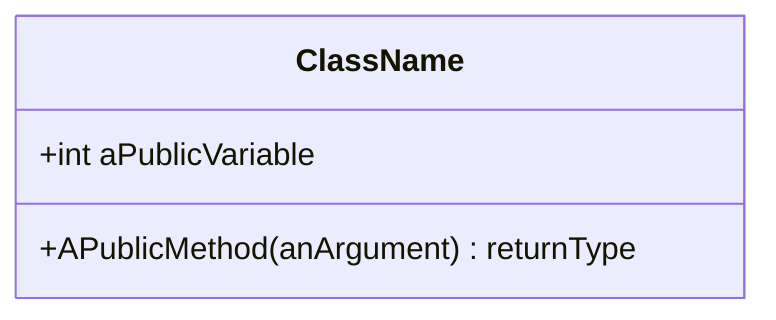

# Week 4 - OOP (Object-Oriented Programming)

[TOC]

## Procedural vs. OOP

| Procedural Programming | Object-Oriented Programmping |
|-|-|
| Data separated from functions | Combine data elements with operations on that data (data and functions are combined) |
| Lack of modularity | Better modularity - everything is self contained |
| High coupling | Low coupling |
| Re-use difficult | Re-use easier |
| Not modelling the real world - The real world doesn't have data separated from behaviour | Closely models the real world |

## The Four Pillars of OOP

### Abstraction - *I don't need to understand the engine to drive a car*

When we describe something in an abstract way (e.g. "I have a car") we have a shared understanding of what the elements are.


**A `Class` is the unit of abstraction**
: OOP Classes represent real-world things (e.g. a bag) and so have:
    - Properties (e.g. bag material, colour, size, handles)
    - Actions (e.g. put things in or remove them from the bag)


### Encapsulation - *Not how does it work, but how do I work it?*

- Each class has a well-defined responsibility

- Internal variables are hidden using `private` fields
    ```csharp
    private string _aPrivateField
    ```
    - Can create visible `get` and `set` methods
    - But can encapsulate as a Property instead
    - Properties are named using `PascalCase`
- and implementation details are hidden as the method code is not visible
    ```csharp
    private static int AnInternalMethod(int parameterOne, int parameterTwo) {}

    public int AnExternallyAvailableMethod(int parameterOne, int parameterTwo) {}
    ```
    - Provide a simple, consistent, well-defined interface to use the object
    - Methods are named using `PascalCase`


### Inheritance - *What data or methods do all objects of this type share?*

- Inheritance hierarchies represent the relationships between objects

- Base class (or Superclass) - What the derived class inherits *from*
- Derived class (or Subclass) - Inherits from the base class
    - The power of derived classes is in their ability to specialise
    - Can call methods on `base` class in derived class methods

Declare a derived class (`DerivedClass`) inheriting from a base class (`BaseClass`) 
```csharp
public class DerivedClass : BaseClass
```

Use base class constructor methods in the derived class constructor

```csharp
public Customer(string fName, string lName, int age) base(fName, lName) 
{
```
Fields in subclasses can be assigned after a reference to superclass for constructor
```csharp
    Age = age;
}
```

### Polymorphism - *Both a camera, and a gun can 'shoot'. The code doesn't need to know which you are holding*

Get a message, do something

i.e. "Start" method... couple apply to a Car, Plane, Washing Machine, Microwave, Job Application

Several kinds of objects that can deal with the same kind of message

## Implementing OOP - Classes

The use of classes encourages high cohesion, and loose coupling.
- Related functionality lives together (high cohesion).
- But a class should only have one reason to change (loose coupling).

### Classes vs. Objects
- An object is an instance of a class that we can use (and provide values for)
- A class is a type of an object

### Naming Conventions

- **Classes** - noun - PascalCase (e.g. `Person`)
- **Field** - noun - underscore using _camelCase (e.g. `_firstName`)
- **Properties** - noun - PascalCase (e.g. `FirstName`)
- **Methods** - verb - PascalCase (e.g. `GetFullName()`)
- **Variables** and method parameters - camelCase (e.g. `firstName`)
- **Constants** - const - PascalCase

### Class Composition
A class is comprised of
#### 1. **Name**
#### 2. **Data** - Class fields are declared after the *class signature* but before any *methods*.
- Private fields (`_camelCase`)
- Public Properties (`PascalCase`)
    - Assigning to a property calls its `set` method.
    - References to the property (`instance.property`) calls its `get` method.
    - Properties refer to "private backing fields" (either auto-generated or specified)
    - Can add logic to `get` and `set` (using `value`) methods.
    - Can create a property as a lambda (get only): `PropertyName => Functionality;`
    - We will only use a setter if we are setting one field at a time.
    - For two or more fields we will only have a getter.
    - Can make a `get` or `set` method internal to the class by specifying an access modifier (e.g. `Property { get; } { private set; }`) even if the property itself is `public`.
    - readonly can be set on declaration `private readonly string _hairColour = "Blonde"` or in the constructor.
    - `public const` or `private const` are set only on declaration.

##### Immutable properties

- To make a property immutable remove `set` and create a constructor that sets the value.
- OR replace `set` method with `init` and using object initializers can be specified on declaration.

#### 3. **Constructors**
|:memo: **NOTE:** If we don't specify ANY constructor then C# creates a parameterless one for us. :memo:|
|-|

- *Constructor signature*
    - Constructor is named the same as the class.
    - Does not have a return type (returns an *instance* of the `class`)
        ```csharp
        public NameOfClass()
        ```
- Constructed objects are allocated memory on the **Heap**, reference is placed on the **Stack**.
- *Parameters and default values*
    - We add parameters to the constructor to allow passing values in to the class
        ```csharp
        public Rectangle(int length, int width)
        ```
    - Can specify default values in both the constructor signature... 
        ```csharp
        public Vehicle(int capacity, int speed = 10)
        {
        ```
        ... or when defining the variables.
        ```csharp
            int numPassengers = 1;
        }
        ```
    - No hard and fast rule for when to set default values (Nish prefers to set on definition)

##### Object initializers
- `{ }` after a constructor to specify internal variables, e.g.  
```csharp
Person jim = new Person() { firstName = "Jim", secondName = "Parsons"};
```
- Can use in place of a paramaterless (default) constructor instead of having several constructors for different cases.

#### 4. **Methods**
- Define methods on the function

### UML Class diagram 
- Represents classes and the relationships between them
- Provide different levels of detail



#### Adding a Class Diagram to a project
- R-Click on the project name in **Solution Explorer**
- Choose **Add -> New Item**
- Select **Class Diagram** from the dialog box, name it (if required), and click **OK**
- Drag `.cs` files from **Solution Explorer** into the diagram.
- Changes made to the class diagram are reflected in the code (can add fields & methods through **Class Details**)

Can show full signatures by going to **Class Diagram** in the toolbar, **Change Members Format** and then **Display Full Signature**.

### Class Inheritance
 
For example, when the `Hunter` derived class inherits from the `Person` base class:
```csharp
public class Hunter : Person
```

 - Inheritance facilitates DRY
 - represents an "is-a" relationship (derived class is-a type of the base class)
 - Cannot access private member variables on the base class from an derived class
 - Can access public properties
 - Can set private member variables by calling the `base` constructor
 ```csharp
 public Hunter(string fName, string lName, string camera = " ") : base (fName, lName)
 ```
 - Derived constructor calls base constructor
 - Base constructor finishes and then runs the body of the derived constructor

 ```mermaid
 sequenceDiagram
    participant Derived
    participant Base
    activate Derived
    Note left of Derived: Derived constructor called
    Derived ->> Base: Base constructor called 
    deactivate Derived
    activate Base
    Note right of Base: Base constructor body executes
    Base ->> Derived: base body finishes
    deactivate Base
    activate Derived
    Note left of Derived: Derived constructor body executes
    deactivate Derived
    Note left of Derived: Constructed object returned
 ```
- If we want a parameterless constructor in a derived class we must also have one in the base class.
- Can call parameterless IF we refer to the base constructor in the call 
    ```csharp
    Hunter () base {"", ""}
    ```

## Structs

- For example `DateTime` is a `struct`.
- In classes you have private fields and public properties, structs have public fields.
- A struct represents one thing (e.g. a single Date and Time)
- `int` is an alias for the struct `Int32`.
- Structs can't inherit (from other structs)
- Can instantiate structs without necessarily calling constructors (i.e. no need to use `new`)
- Structs are VALUE types, not REFERENCE types.

# Week 4 - Advanced NUnit Testing

## Testing Classes and Structs

- Need to instantiate a class to test the methods on it.

## Glossary

Class
: The unit of abstraction. Has a name, private fields, public properties, constructpors and methods. Must be instantiated before it can hold data.

Method Overloading
: Same signature but with different numbers of parameters

Object Initialization
: Specify internal variables by using `{ }` after the constructor call

Classic Model of Testing
: e.g. Assert.IsEqual...

Constraint Model of testing
: e.g. Assert.That...
