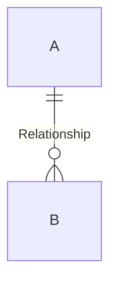
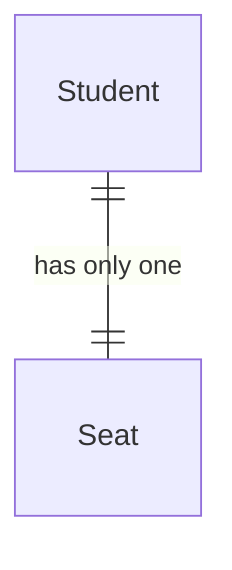

# Teachable Course - SQL Fundamentals

##  Course introduction

SQL - Structured Query Language
Language to communicate with databases

##  Databases
(Data warehouse or Data lake)
### Flat-File
- Plain text format
- A single table
- Limited number of records related to a single topic (e.g. Spreadsheet, CSV)


### Relational (SQL) Databases
- Contain tables that are related to each other in some way.

- Relational Database Managerment Systems (RDBMS)
    - Take instructions in SQL and interpret them
    - Different RDBMS have slight differences in syntax
    - Many - Some popular ones are: 
        - MySQL (popular, open-source)
        - Oracle (proprietary - banking sector)
        - PostgreSQL (open-source, web applications - reliable)
        - SQLite (open-source, light, bundling database with application)
        - Microsoft SQL Server - Tools are (SQL Server Management Studio, Azure Data Studio)

- Recognises relationships between stored items
- Many relational databases use SQL
- Primary Feature: All the Tables should be connected in some 

- What are the real-world relationships between the data? Consider this when designing a database

- Linked fields in different tables through keys

#### Primary Key (e.g. ISBN for books)
- Identifies each record in the Table
- Must be unique
- Cannot be empty
- Cannot be changeable
- Can be a single column (simple)
- Can be multiple columns (composite) (e.g. Order Number & Line Number in an order )
- One Primary Key per table
- Most RDBMS can be set to produce an Autoincrement ID

#### Foreign Keys
- Reference Primary Keys of other Tables
- A table can have any number of Foreign Keys
- Values do not have to be unique
- Add ID column in one table that reflects Primary Key in another table
- The RDBMS will prevent any changes that violate the relationship constraints

- Repeating the same information in the same database is known as data redundancy - It makes it MUCH harder to update.

### Non-Relational (NoSQL [Not only SQL]) Databases
- Incredibly valuable in cases where the data don't fit into the rigid structure that comes with table oriented relational database.

## Data Modelling

- Data models detail *how* elements relate to one another
- Three levels

Conceptual (Least Granular Model)
: Broad level business understanding of the data structure
: Comprises - Entity Names, Entity Relationships

Logical (Next level)
: Defines the structure of data elements and the relationships between them independent of the RDBMS
: Comprises - Entity Names, Entity Relationships, Attributes, Primary Keys (PK), Foreign Keys (FK)

Physical
: Specific implementation of the data model dependent on the RDBMS being used
: Comprises - Primary Keys (PK), Foreign Keys (FK), Table Names, Column Names, Column Data Types

Entity
: Anything in the world that we store data on.
: Store data on different entities in different tables (e.g. Books, Authors, Publishers)

### Types of Relationdship

One-to-one
: Each record only has one relationship to one other record and vice-versa

One-to-Many
: One record can have multiple relationships with records in another Table
: Allows frequently used information to be saved only once in a Table and referenced many times in all other Tables

Many-to-Many
: Many records in one Table can be related to many records in another Table
: To describe this relationship a Mapping, Link, or Junction Table is required - Sometimes named after the relationship they capture.


## ERD
- A way to visualise the structure of databases

- Crow's foot notation

- Represents all entities in our data model
- Each entity represented by a table in the database
- Each entity (Table) has *Attributes* (columns)
- Relationships shown with lines
- Can use *Crow's Foot Notation* to describe relationships in more detail

### Crow's Foot Notation

At A - Maximum One, Minimum One
"One and only one"

At B - Maximum Many, Minimum Zero
"Zero or many"

- Symbols can be combined (e.g. "Zero or one", "One or many")
- Maximum indicator is next to the entity
- Minimum indicator is outside of the maximum indicator

#### Relationship examples

##### One-to-One



##### One-to-Many


##### Many-to-Many

This may need a *Mapping* or *Junction* Table.

## Normalisation and Normal Form

### Normalisation

- Making databases more efficient (Database Normalisation)
- Process of separating our data out into separate Tables
- How we can measure the degree to which a database has been normalised

Pros
- Normalisation exists to reduce data redundancy
    - Eliminates repeated information
- Increases ease of database maintenance
    - One source of truth for each entry
    - Easier Inserts
        - Can insert data about single entity
    - Easier Updates
        - One location for each update
    - Easier Deletes
        - One location of each delete

Cons
- Increases database depth
    - More Tables
- Increases difficulty of querying
    - Multiple Joins required
        - More effort for analysts/devs
        - More computational effort

TIP: If we are prioritising speed then an un-normalised database might be desirable.

### Normal Forms
- Properties that databases can have that describe the level of normalisation that has take place.
- Each Normal Form has criteria that must be met for the database to be said to be in that Normal Form.
- There are six numbered Normal Forms with others in between
- Sixth Form is the highest, representing the highest degree of normalisation

- Normal standards for designing databases

#### First Normal Form (1NF)
- The data must be atomic - Data is presented as small as it possibly can be
- There are no repeated groups - Saved on the same attribute across multiple columns
- Each row must be unique

#### Second Normal Form (2NF)
- Already in First Normal Form
- All non-key attributes must functionally depend upon the full primary key.
    - Each Table should be doing a single job - defining a single Entity
- Comes in when we have a composite primary key

#### Third Normal Form (3NF)
- Already in Second Normal Form
- There are no transitive dependencies (no dependency chains)

When we say "Normalised" we are usually referring to Third Normal Form (3NF)


## Database Setup - Visual Studio (Windows)

- VS Installer -> Modify -> Additional Components -> SQL Server Data Tools
- Launch VS -> View -> SQL Server Object Explorer
- R-Click on (localdb) -> New Query

## Database Setup - SQL Fiddle (Mac / Linux)

- www.sqlfiddle.com
- In dropdown at the top select MS SQL Server 2017
- Insert commands in left-hand "schema" panel (DDL panel)
- Interactions with Tables in the right hand panel

## Database Creation

### Creating Databases

- `CREATE DATABASE sparta_demo;` (if you include other characters then the name must be referenced using `[]` such as `[sparta demo]`)

- End statements with `;`
- Convention to use commands in `UPPER CASE` and `lower_case` for names of bjects   

- A server can hold multiple databases
- A database can hold multiple tables

- SQL server is an RDBMS

### Creating Tables

`USE sparta_demo;`
: use this database for the rest of the script
: can also select database from the dropdown list

```sql
CREATE TABLE personnel (
    first_name VARCHAR(20),
    last_name VARCHAR(20)
)
```

`VARCHAR(20)`
: holds characters
: (20) sepecifies the maximum size (in Bytes)

- SQL doesn't care how much whitespace you use, as long as there is some
- Can format for readability

- `dbo` - Database Owner - How SQL categorises Tables.

#### Creating a table that already exists

```sql
Msg 2714, Level 16, State 6, Line 1
There is already an object named 'personnel' in the database.
```

### Dropping Tables

- R-Click or use query

- `DROP TABLE personnel;` - Immediately drops the table and any data associated with it.

#### Dropping a table that doesn't exist

```sql
Msg 3701, Level 11, State 5, Line 1
Cannot drop the table 'personnel', because it does not exist or you do not have permission.
```
### `IF EXISTS`

Can drop a table only if it exists (getting arounf the error by using the `IF EXISTS` keywords, e.g.

```sql
DROP TABLE IF EXISTS personnel;
```

To create a table when we know we will only ever want to run the query from scratch:

```sql
DROP TABLE IF EXISTS personnel;

CREATE TABLE personnel (
    first_name VARCHAR(20),
    last_name VARCHAR(20)
)
```

This query will *always* execute without errors.

## Data Types

[`--` shows a comment in SQL]

- Different types of SQL server may use different data types
- What follows are *not* all of the data types available in Microsoft SQL server (INT, BIGINT)
- `VARCHAR(MAX)`
- `CHAR(11)`
- `DATE`
- `TIME`
- `DATETIME`
- `INT`
- `DECIMAL(4,2)` - (Precision, Scale) - (Max Digits, Digits after dp) - e.g. 32.15
- `FLOAT(24)` - Maximum number of digits. Imprecise. Better for very big and very small. Not good for precise calculations
- `BIT` - 1 or 0 (or True and False respectively)


## Inserting Data

**[input the data in the same order the columns are listed]**

```sql
INSERT INTO personnel (
    first_name, last_name, notes, phone_number,
    birthdate, first_shift_start, lunch_break, number_of_awards,
    hourly_rate, height_meters,
    is_full_time
) VALUES (

)
```

- specify all columns
- then specify all values
    - use single quotes around `CHAR` and `VARCHAR` e.g. `JOE`
    - use single quotes around `DATE`, `TIME`, `DATETIME`
        - uses `YYYY-MM-DD` format for `DATE`
        - or `YYYY-MM-DD HH:MM:SS` format for `DATETIME`
        - or `HH:MM:SS` format for time `TIME`
    - no need for single quotes for numbers, scientific number notation, or `BIT` values

### `INSERT`ing multiple rows

- Can insert multiple rows
    - Each row in its own set of `()`
    - Comma `,` between each row

```sql
INSERT INTO personnel (
    first_name, last_name
) VALUES
('Joe', 'Bloggs'),
('Jane', 'Doe');
```

- Values can be specified not in the order of the columns of the Table, as long as they match the order of the columns given in the `INSERT INTO` statement.

- Columns not specified are set to `NULL`

### `NULL`

- SQL representation of a missing value
- Null isn't a value (not 0, or '')
- *"Nothing equals Null"*
    - Anything != NULL
    - NULL != NULL
- Represents the attribute of *being* missing or absent

Test for `NULL` with `IS NULL` or `IS NOT NULL`

## Constraints

- `NOT NULL` - Can't tolerate missing values, e.g.
```sql
CREATE TABLE films (
    film_title VARCHAR(180) NOT NULL,
    ...
);
```
- `DEFAULT` - Set a default value, e.g.
```sql
CREATE TABLE films (
    ...
    is_oscar_winning BIT DEFAULT 0
);
```

## Primary Keys

- Create relationships between Tables

```sql
DROP TABLE IF EXISTS courses;

CREATE TABLE courses (
    course_id INT PRIMARY KEY,
    course_name VARCHAR(20)
);
```
- `PRIMARY KEY` specifies the data is for a primary key and **must** be unique.

If we try and add duplicate keys we get:
```sql
Msg 2627, Level 14, State 1, Line 8
Violation of PRIMARY KEY constraint 'PK__courses__8F1EF7AE61AF3F09'. Cannot insert duplicate key in object 'dbo.courses'. The duplicate key value is (12).
The statement has been terminated.
```
If we try to add a `NULL` or missing key we get:
```sql
Msg 515, Level 16, State 2, Line 8
Cannot insert the value NULL into column 'course_id', table 'sparta_demo.dbo.courses'; column does not allow nulls. INSERT fails.
The statement has been terminated.
```

#### UNIQUE
- Enforce uniqueness without making a column a `PRIMARY KEY`

```sql
    course_name VARCHAR(20) UNIQUE
```

Entering non-unique values in a `UNIQUE` colum returns the error:

```sql
Msg 2627, Level 14, State 1, Line 8
Violation of UNIQUE KEY constraint 'UQ__courses__B5B2A66A1A1963FA'. Cannot insert duplicate key in object 'dbo.courses'. The duplicate key value is (ENG 120).
The statement has been terminated.
```

#### IDENITY (autoincrementing keys)

```sql
    course_id INT PRIMARY KEY IDENTITY,
```
uses the default which is the same as
```sql
    course_id INT PRIMARY KEY IDENTITY(1, 1),
```
start at 1 and increment by 1 with each record


## Foreign Keys

```sql
DROP TABLE IF EXISTS students;
CREATE TABLE students (
	student_id INT PRIMARY KEY IDENTITY(1, 1),
	student_name VARCHAR(20),
	course_id INT FOREIGN KEY REFERENCES courses (course_id)
);
```
- Specify foreign key column using `FOREIGN KEY`
- followed by the `REFERENCES` keyword to identify first the
    - Table name: `courses` and
    - Column name: `(course_id)`

- Entering a foreign key that doesn't exist throws an error

```sql
Msg 547, Level 16, State 0, Line 25
The INSERT statement conflicted with the FOREIGN KEY constraint "FK__students__course__6383C8BA". The conflict occurred in database "sparta_demo", table "dbo.courses", column 'course_id'.
The statement has been terminated.
```

- Trying to drop the table that contains the foreign key values for another Table's `FOREIGN KEY` causes an error:

```sql
Msg 3726, Level 16, State 1, Line 1
Could not drop object 'courses' because it is referenced by a FOREIGN KEY constraint.
```

## Updating Tables

### `ALTER TABLE`

To add columns:
```sql
ALTER TABLE films
ADD budget DECIMAL (10,0), synopsis VARCHAR(200);
```

To modify existing columns:
```sql
ALTER TABLE films
ALTER COLUMN runtime_mins DECIMAL(5, 2);
```

To drop columns
```sql
ALTER TABLE films
DROP COLUMN box_office_use
```

### `UPDATE`

[`SELECT * FROM ice_cream`]

Update one or more values in a Table

```sql
UPDATE ice_cream
SET flavour  = 'Mint Chocolate Chip'
WHERE id = 2;
```

- **Every** record that matches there criteria in `WHERE` will be updated. Be careful.

```sql
UPDATE ice_cream
SET price = 4.99
WHERE price = 3.99
```
This would change the price of **any** ice cream that has a price of 3.99

To remove rows
```sql
DELETE FROM ice_cream
WHERE flavour = 'Raspberry Ripple'
-- WHERE id = 3
```

## SQL Learning Path

SELECT column
FROM table

Logical Sequence / Syntax Sequence

- SELECT
- DISTINCT
- FROM
- WHERE
- GROUP BY
- HAVING
- ORDER BY

-- SQL request(s)​​​​​​‌​​‌‌​‌‌​‌‌‌​​‌​​‌​​​​​​‌ below
SELECT DISTINCT pc.name, AVG(pr.price) AS "Average Price"
FROM product pr
    JOIN product_category pc
    ON pr.product_category_id = pc.product_category_id
WHERE pr.name LIKE '%0%'
GROUP BY pc.product_category_id
HAVING AVG(pr.price) > 100
ORDER BY pc.name ASC


Processing Sequence

- FROM
- WHERE
- GROUP BY
- HAVING
- SELECT
- DISTINCT
- ORDER BY

### SELECT

```sql
SELECT column1, column2, column3
FROM table1
```

We can use **aliases** to change how a column is displayed in the output

```sql
SELECT phone_number AS "Phone Number"
FROM customer
```

To return all columns we use the `*` wildcard.

```sql
SELECT *
FROM customer
```

Use of aliases
```sql
SELECT firstname AS "First Name", lastname as "Last Name", birth_date AS "Date of Birth"
FROM customer;
```

### WHERE

```sql
SELECT *
FROM product
WHERE name = 'Chromecast'
```

- Operator `=` means *exactly equal to*

```sql
-- SQL request(s)​​​​​​‌​​‌‌​‌‌​‌‌‌​​‌​​‌​​​​​​‌ below
SELECT firstname AS "First Name", lastname AS "Last Name", city AS "City"
FROM customer
WHERE city = 'Montpellier'
```

#### Comparison Operators
- `<` Less that
- `>` More than
- `<=` Less than or equal to
- `>=` More than or equal to
- `!=` Not equal to

```sql
-- SQL request(s)​​​​​​‌​​‌‌​‌‌​‌‌‌​​‌​​‌​​​​​​‌ below
SELECT name, description, price
FROM product
WHERE price >= 100
```

#### Multiple Comparisons

- Can use logical comparators such as `AND`
- `OR`
- `NOT`

```sql
-- SQL request(s)​​​​​​‌​​‌‌​‌‌​‌‌‌​​‌​​‌​​​​​​‌ below
SELECT name, price, available_stock
FROM product
WHERE price < 10 OR available_stock >= 3000
```

#### WILDCARDS

- Used with `LIKE` in the `WHERE` clause

- `-` Substitutes one character
- `%` Zero or more characters
- `[ABC]` Square brackets specify multiple characters to match
- `^` Negates characters in a square bracket `[^ABC]` gives NOT A, B or C

```sql
-- SQL request(s)​​​​​​‌​​‌‌​‌‌​‌‌‌​​‌​​‌​​​​​​‌ below
SELECT name, price, description
FROM product
WHERE description LIKE '%HD%'
```
Returns name, price and description if description contains 'HD' anywhere.

#### BETWEEN
- Used to simplify `WHERE` statements
```sql
SELECT *
FROM product
WHERE price >= 50 AND price <= 100
```
can be rewritten as
```sql
SELECT *
FROM product
WHERE price BETWEEN 50 AND 100
```

Connecting statements using `BETWEEN`
```sql
-- SQL request(s)​​​​​​‌​​‌‌​‌‌​‌‌‌​​‌​​‌​​​​​​‌ below
SELECT name, description, price, available_stock
FROM product
WHERE available_stock BETWEEN 10 AND 20 AND price > 100;
```

#### IN

Can collapse multiple OR statements
```sql
SELECT *
FROM customer
WHERE firstname = 'James' OR firstname = 'Roger' OR firstname = 'Jean-Claude';
```
Use `IN` with the options in `()`.
```sql
SELECT *
FROM customer
WHERE firstname in ('James', 'Roger', 'Jean-Claude');
```

#### `IS NULL` or `IS NOT NULL`

#### `TOP`

```sql
SELECT TOP 5 *
```
Select all columns on the top 5 rows of the query

#### `ORDER BY`

Order the results either ascending `ASC` or descending `DESC`
- Best practice to specify explicitly even though default is `ASC`

```sql
SELECT *
FROM customer
ORDER by lastname ASC, firstname ASC
```

#### `DISTINCT`

Include each entry only once

```sql
SELECT DISTINCT lastname
FROM customer
```

#### Concatenation

- SQL server
```sql
SELECT firstname + ' ' + lastname as 'Full Name'
FROM customer;
```
- ANSI SQL
```sql
SELECT firstname || ' ' || lastname as 'Full Name'
FROM customer;
```

#### String Functions

- `UPPER()`, `LOWER()`, `TRIM()`, `LTRIM()`, `RTRIM()`, `LENGTH()`, `LEFT()`, `RIGHT()`, `POSITION()`, 

#### Date Functions
- `GETDATE()`, `DATEADD()`, `DATEDIFF()`, `YEAR()`, `MONTH()`, `DAY()`

#### `CASE` Statements

```sql
SELECT *
    CASE
        WHEN condition THEN result
        ELSE default_resault
    END AS "Column Name"
FROM table;
```

#### Aggregation Functions
- `SUM()`, `AVG()`, `MIN()`, `MAX()`, `COUNT()`

#### `GROUP BY` and aggregate functions

- Group data by a column... then apply an aggregate function to the group
- Everything in the `SELECT` clause must be an aggregate, or appear in the `GROUP BY` clause

#### `HAVING`
- Filter based on aggregation
```sql
    HAVING AVG(price) < 200;
```

#### `JOIN`

- Join Tables on matching values in a column
- `JOIN` is part of `FROM` clauses

```sql
SELECT *
FROM LeftTable
LEFT JOIN RightTable
ON LeftTable.KeyColumn = RightTable.KeyColumn
```

Avoid `RIGHT JOIN`, refactor to us `LEFT JOIN`
`INNER` join and `OUTER`

- Can have multiple `JOIN`s

#### Subqueries

- Can enclose sub-queries in the `SELECT`, `FROM`, and `WHERE` clauses


##### `SELECT` subqueries
```sql
-- SQL request(s)​​​​​​‌​​‌‌​‌‌​‌‌‌​​‌​​‌​​​​​​‌ below
SELECT
    name AS "Name",
    price AS "Price",
    price - (SELECT AVG(price) FROM product) AS "Avg Price Diff"
FROM product;
```

##### `FROM` subqueries

##### `WHERE` subqueries

##### `UNION` and `UNION ALL`
