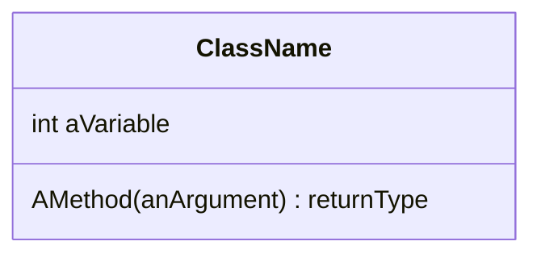

# Day 12 - 12/07/2022

[TOC]

## Classes

Encourages high cohesion, and loose coupling.
- Related functionality lives together (high cohesion).
- But a class should only have one reason to change (loose coupling).

### UML Class diagram 
- Representing classes and the relationships between them
- Different levels of detail



Add to project - Class Diagram
- Drag `.cs` files from **Solution Explorer** into the diagram.
- Changes made to the class diagram are reflected in the code (can add fields & methods)

Can show full signatures by going to **Class Diagram** in the toolbar, **Change Members Format** and then **Display Full Signature**.

### Class Constructors

- Does not have a return type (returns an instance of the class)
- Constructed objects are allocated memory on the **Heap**, reference is placed on the **Stack**.
- If we don't specify ANY constructor then C# creates a parameterless one for us.
- Can specify default values in both constructor signature or when defining the variables.
- No hard and fast rule for when to set default values (Nish prefers to set on definition)

### Class Properties

- Assigning to a property calls its `set` method.
- References to the property (`instance.property`) calls its `get` method.
- Properties refer to "private backing fields" (either auto-generated or specified)
- Can add logic to `get` and `set` (using `value`) methods.
- Can create a property as a lambda (get only): `PropertyName => Functionality;`
- We will only use a setter if we are setting one field at a time.
- For two or more fields we will only have a getter.
- Can make a `get` or `set` method internal to the class by specifying an access modifier (e.g. `Property { get; } { private set; }`) even if the property itself is `public`.
- readonly can be set on declaration `private readonly string _hairColour = "Blonde"` or in the constructor.
- `public const` or `private const` are set only on declaration.

### Object initializers

- `{ }` after a constructor to specify internal variables, e.g.  
```csharp
Person jim = new Person() { firstName = "Jim", secondName = "Parsons"};
```
- Can use in place of a paramaterless (default) constructor instead of having several constructors for different cases.

### Immutable properties

- To make a property immutable remove `set` and create a constructor that sets the value.
- OR replace `set` method with `init` and using object initializers can be specified on declaration.

## Naming Conventions

- **Classes** - noun - PascalCase (e.g. `Person`)
- **Field** - noun - underscore using _camelCase (e.g. `_firstName`)
- **Properties** - noun - PascalCase (e.g. `FirstName`)
- **Methods** - verb - PascalCase (e.g. `GetFullName()`)
- **Variables** and method parameters - camelCase (e.g. `firstName`)
- **Constants** - const - PascalCase

## Structs

- For example `DateTime` is a `struct`.
- In classes you have private fields and public properties, structs have public fields.
- A struct represents one thing (e.g. a single Date and Time)
- `int` is an alias for the struct `Int32`.
- Structs can't inherit (from other structs)
- Can instantiate structs without necessarily calling constructors (i.e. no need to use `new`)
- Structs are VALUE types, not REFERENCE types.

## Testing Classes and Structs

- Need to instantiate a class to test the methods on it.

## Inheritance
 
For example, when the `Hunter` derived class inherits from the `Person` base class:
```csharp
public class Hunter : Person
```

 - Inheritance facilitates DRY
 - represents an "is-a" relationship (derived class is-a type of the base class)
 - Cannot access private member variables on the base class from an derived class
 - Can access public properties
 - Can set private member variables by calling the `base` constructor
 ```csharp
 public Hunter(string fName, string lName, string camera = " ") : base (fName, lName)
 ```
 - Derived constructor calls base constructor
 - Base constructor finishes and then runs the body of the derived constructor

 ```mermaid
 sequenceDiagram
    participant Derived
    participant Base
    activate Derived
    Note left of Derived: Derived constructor called
    Derived ->> Base: Base constructor called 
    deactivate Derived
    activate Base
    Note right of Base: Base constructor body executes
    Base ->> Derived: base body finishes
    deactivate Base
    activate Derived
    Note left of Derived: Derived constructor body executes
    deactivate Derived
    Note left of Derived: Constructed object returned
 ```
- If we want a parameterless constructor in a derived class we must also have one in the base class.
- Can call parameterless IF we refer to the base constructor in the call `Hunter () base {"", ""}`{.csharp}

## Glossary
*Method Overloading* - Same signature but with different numbers of parameters
*Object Initialization* - Specify internal variables by using `{ }` after the constructor call
*Classic Model* vs *Constraint Model* of testing
