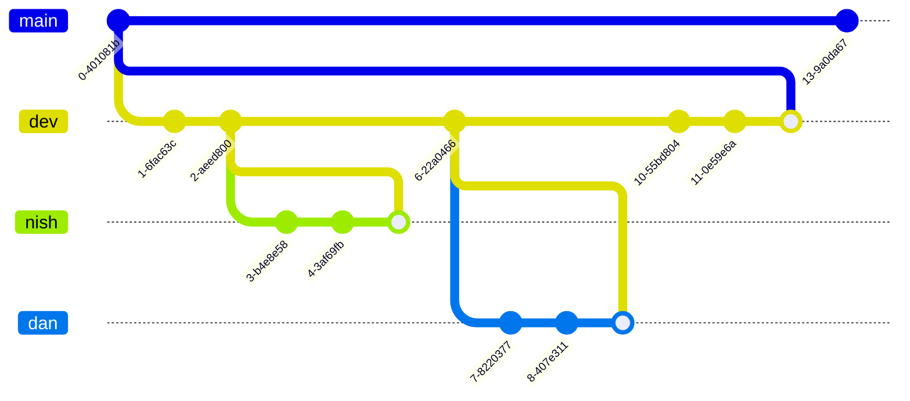

# Day 17 - 19/07/2022 - Using Git Collaboratively

- Only commit to main branch at the end of each sprint
- Make all changes to the dev branch
- (Default should be dev branch)

- Create a feature branch (named?)

`git clone <URL FROM GitHub>`

`git branch` - what is the current branch

`git branch -D <name of branch>`

`git checkout -b <name of branch>` - create a new branch and check it out

`git switch` - switch branches

`dotnet new console` - create new console application

[Use TypeDown?]
[`GitTortoise`]

`git push`

`git push --set-upstream origin dev` - Push this upstream

`git pull origin nish` or `git pull origin`

Settings -> Branches -> Branch Protection Rule -> Require a pull request before merging.
Settings -> Default branch -> take it OUT of `main` into `dev`

use git bash
Anyone who clones will get the same default branch as you

`git branch -a` - lists all branches

Go to pull requests
click on Files Changed
check and then leave a Review

After pull requests merged
`git branch dev` - move back to the now merged dev branch
`git pull` - pull down the changes from GitHub to the local version

`git checkout -b ellis origin/ellis`

`merge conflict` - When branches can't be merged
Only use - GitTortoise, CLI, GitHub extension on VisualStudio

`git merge <branch to merge into the current branch>`
Edit conflicted files manually and merge locally rather than on github.
`git merge dev` back into your working branch
