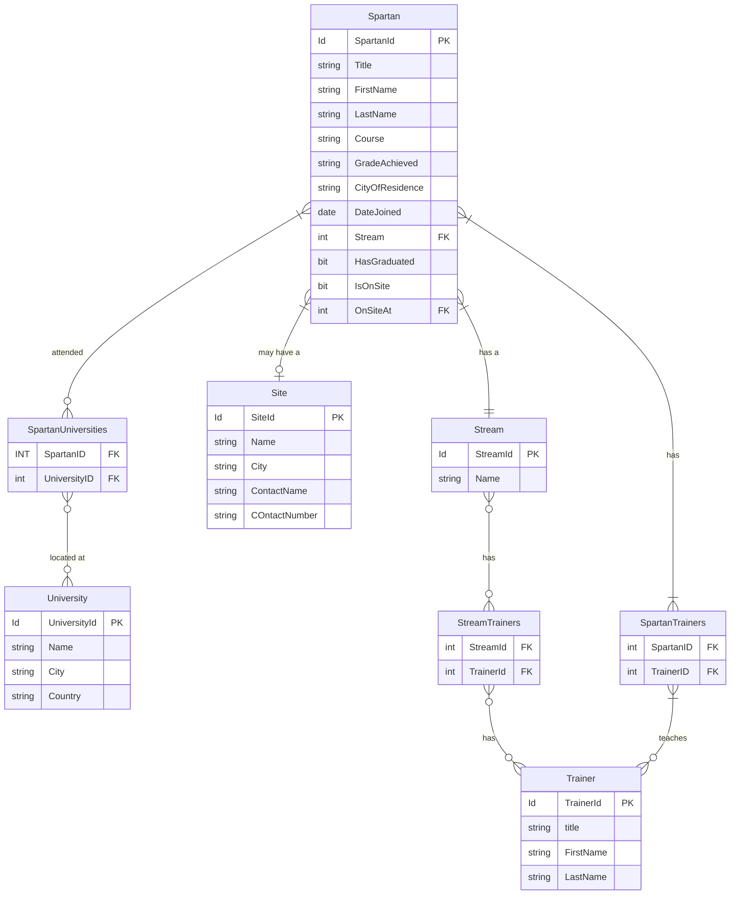

# Day 21 - 25/07/2022 - Academy DB

```mermaid
erDiagram
    Spartan {
        Id SpartanId PK
        string Title
        string FirstName
        string LastName
        string Course
        string GradeAchieved
        string CityOfResidence
        date DateJoined
        int Stream FK
        bit HasGraduated
        bit IsOnSite
        int OnSiteAt FK
    }
    Spartan }|--|| Stream : "has a"
    Spartan }|--O| Site: "may have a"
    University {
        Id UniversityId PK
        string Name
        string City
        string Country
    }
    SpartanUniversities {
        INT SpartanID FK
        int UniversityID FK
    }
    Spartan }|--o{ SpartanUniversities : "attended"
    SpartanUniversities }o--o{ University : "located at"

    Stream {
        Id StreamId PK
        string Name
    }
    StreamTrainers {
        int StreamId FK
        int TrainerId FK
    }
    Trainer {
        Id TrainerId PK
        string title
        string FirstName
        string LastName    
    }
    Stream }o--o{ StreamTrainers : "has"
    StreamTrainers }o--o{ Trainer : "has"
    Spartan }|--|{ SpartanTrainers : "has"
    SpartanTrainers {
        int SpartanID FK
        int TrainerID FK
    }
    SpartanTrainers }|--o{ Trainer : "teaches"
    Site {
        Id SiteId PK
        string Name
        string City
        string ContactName
        string COntactNumber
    }
```

