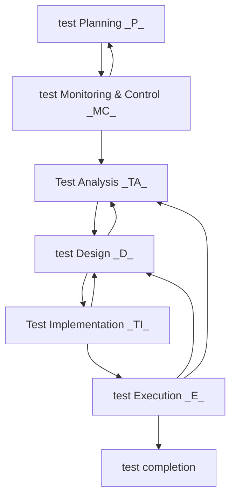

- # Day 22 -  26/07/2022 - ISTQB Day 1

*"The ISTQB is a nightmare"* - Nish

[TOC]

Why the ISTQB?
- ISTQB jobs is globally recognised
- Many testing jobs require Foundation certificate
- Its a basis/framework for common discussions and principles of testing

Study and Revision Approach:
- Go through handouts (ISTQB resources)
- Go through loads and loads and loads of test papers
- Save all the handouts
- Save all the practice tests
- 1 PDF for each chapter of the book

Structure of the Test
- Aim for 40/40 on test (pass mark is 26)
- 1 Hour for 40 multiple-choice questions
- K-1 Definition
- K-2 Given scenario, what is the ____? (Action?)
- K-3 Given data, apply testing technique, select answer

Chapter 4 has the most questions

## Fundamentals of Testing?
Why Testing
- Quality is what the customer wants
- Testing ensures quality by meeting the requirements
- Testing for each requirement creates tests that are happy AND sad paths (e.g. how would you test the happy AND sad path)
- A tester *assesses* quality, not *improves* quality but finding the defects and raising the ticket
- Developers *improves* quality
- Testers are not *directly* involved

Test Basis
: Anything we derive our tests (requirements) from (user manual, requirements - user stories, process diagram)

Test Condition
: Features of a system that needs testing (e.g. Basket Feature, Sign-out Feature)

Test Cases
: Individual scenarios on Test Conditions
: Has an "expected" result, and an "actual" result

Test Procedures (or Test Script)
: Individual steps that allow us to execute a test case
: Given, When, and Then are individual Test Procedures

Test Suite (Test Explorer in VS)
: A collection of Test Cases

Error
: A human action that leads to an incorrect result
: (e.g. BA getting incorrect requirements, or typo in requirements)

Defect (Finding defects is our bread and butter)
: The actual result doesn't meet the expected result

Failure
: A defect that is found by the user
: It doesn't meet the user's expectation

- An Error doesn't necessarily lead to a Defect
- A Defect doesn't necessarily lead to a Failure

Root Cause Analysis
: Fixing a defect costs more the later it is found because the Root Cause has to be found
: Unit testing identifies defects as early as possible and makes their Root Cause easy to identify
: 5 Whys?

**REMEMBER: Early Testing Is Imperative**

We can't find some defects until we get to the next level of testing e.g. Unit Tests -> Integration Tests -> End-to-End Tests

Debugging 
: By developers - identify the cause of bugs or defects in code and **undertake corrections**

Testing
: By testers - explore system to find and **report defects**

- ISTQB glosssary can be used to understand terms
- https://glossary.istqb.org/en/search/
- Ask Nish for better, tighter definitions

## Quality Assurance and Testing

Quality Assurance
: Focus on adherence to procedures and processes that are in place to ensure Quality - *"How is the product being developed and tested?"*
: test strategy, coding standards, design standards, reviews, etc.

Quality Control
: Activities that support achievement of quality

Testing
: Check if the system operates as it should and find defects

Testing reduces the level of risk to the quality of the system

### Testing's contribution to success
 - Early involvement means early detection
 - Improves understanding of the system for testers AND developers
 - Improves understanding of the code for testers AND developers
 - Verification and validation of software prior to release can **detect failures** that might otherwise have been missed
 - Involved during the whole life cycle from requirements to release

 ## PM Session - Chapter 1 Continued...

Developer / Test Mindset
- Must be mutual respect on both sides
- Starting to get the tester to adopt the mindset appropriate to a tester
- Developers are creators, Testers are destroyers - Can cause a difficult relationships - engage developers properly - only trying to help
- e.g. We ran 50 tests against the requirements, we had an 80% failure rate, (could you have a look at these please?)? [Critque sandwich?]
- You don't know the pressures the developer has been through to get this finished
- As long as you have done your job you can rest easy - Your job is just find and report the defects

- "Make sure you do the 'critique' sandwich" - Nish

### The Seven Testing Principles

1. Testing shows the presence of bugs, *not* their absence - Find them, report them, "one grey swan does not disprove that all swans are white".
2. Exhaustive testing is impossible - You can't test every single combination.
3. **Early testing** - Get involved as early as possible. Starting right from the requirement stage upwards.
4. Defect clustering - Preto's Principle - 80/20 - 80% of the defects occur in 20% of the code (or something like that) - In a complex system 80% of the defects will be found in 20% of the modules.
5. The Pesticide Paradox - If you keep using the same test cases over and over again, those test cases will eventually pass - The same tests aren't going to uncover **new** defects. We need exploratory testing.
6. Testing is context dependent - How we test at Unit, Integration, GUI levels are different. What your testing in terms of the system, and also in terms of functionality.
7. Absence of errors fallacy - An error is different from a defect - if it doesn't meet the user requirements then it is a failure.

### Testing Through the Lifecycle

- Test Plan - Live updated document
- Test Monitoring & Control

Memorize "The Test Process" Diagram

PMC, TAD, TIE
Remember the *Work Products* for each one

#### Test Planning
- Specifying suitable test techniques and tasks
- Who does what
- Creating a test schedule for meeting a deadline 
- Define Exit Criteria (test completion criteria)
Work Products
- Test plans (What we are testing? What test technique are we using?)
- Test schedule

#### Monitoring & Control (whole lifecycle)
Monitoring - How many tests done vs. tests planned (progress)
Control - Any necessary actions taken if there are any deviations (e.g.  more tests may be needed)
Supported by the evaluation of exit criteria (definition of done)

Looking at exit for test execution for a stage of testing might include
- ...

Work Products
- Test Progress Reports (how much work we've done)
- Test Summary Reports (audience relevant details)

#### Test Analysis
- What is going to be tested?

- Analyse test basis (any and ALL documentation)
    - Create testable conditions (e.g. Sign in, Create, Check out)

Work Products
- Test Conditions (prioritised)
- Test Charters (related to Exploratory Testing - Like Test Conditions for Exploratory testing - Like a diary of testing to explain their journey through the system)

#### Test Design

- How to test?

- Design and priortise test cases
- Identify test data to SUPPORT the test cases
- Identify test data to be used IN the test cases
- Design test environment (not implemented)
- Traceability - For each Test Condition we create multiple Test Cases - Tracing from Case to Condition to Requirement (Basis)
- Test conditions are further refined

Work Products
- Test Cases and sets of Test Cases to exercise the test conditions defined in test analysis
- Test data design/identification
- Test environment design

#### Test Implementation
- "Is everything in place so that we can begin testing?"

- Create our Test Procedures
- Create Test environment
- Create Test data
- Create Test schedule

Work Products
- Test procedures and the sequencing of those test procedures
- Test suites
- Creation and verification of the test environment and test data
- A test execution schedule

#### Test Execution

Work Products
- Documentation of the status of individual test cases or test procedures (e.g. ready to run, pass, fail, blocked, deliberately skipped, etc.)
- Defect reports Documentation

#### Test Completion

Work Products
- Test summary reports (for project stakeholders)
- Actionable items for improvement in subsequent projects (Lessons Learnt)
- Finalised testware (everything associated with the testing)

#### Traceability

- Can I trace work products
e.g.
Req 1 -> TestCase 1.1, TestCase 1.2 -> Defect 1.1.1

Can then

Defect 1.1.1 -> TestCase 1.1 -> Req 1

Should be able to trace a test case back to where it was derived from.
Can use priorty to derive effective impact report

- Traceability allows relating back test results to stakeholders in ways they understand

## Chapter 2 - SDLC (Software Development Lifecycles)

[Regression testing is usually in Agile]

Choose approach based on
- Nature of the project (small/big, need lots of comms? location of people)
- Project schedule
- Resource availability

### Sequential Life Cycles

Waterfall Model (understand what it is, and pros & cons)
- Royce's Waterfall Model

- Testing is at the end
- Defects are not identified until late
- Defects are difficult to change at this stage

#### V-Model
Structure
- Abides by early testing as tests are written at the time documents become available
- Requirements -> Code -> Test

RFTP - Really Fun Test Process
UISA - 

Integration - Two different components, or DB and programme, or application and payment system
System - End to End testing
A - Alpha, Beta testing

Flow
- Write tests while we gather the requirements
- Coder coders it
- Execute pre-written tests as soon as the code is complete

Validation - Are we doing what it says in the requirements (are we building the *right* product?) (No information is being lost, no ambiguities or errors)
Verification - Are we builing the product correctly? (procedures & processes)

Pros
- Defects found early
- Testers get involved as soon as the documentation becomes available

- Waterfall model that focusses on tests

- Test prep can be separated from execution
- V-Model might have more or less levels (e.g. SIT and CIT)

### Incremental Life Cycles

#### Agile (e.g. Scrum, Kanban, RUP, Spiral)
- What is Agile
- At the end of every spring we have a piece of incremental software that has been tested
- Regression tests are in Agile and are automated

**80% of the ISTQB is going through past papers**

## Testing Levels
*"Every testing level has its own objectives and characteristics specific to thar level"* - Nish

- Unit
- Integration
- System
- Acceptance

Types of things that are common to test at that level
Common objectives at each level

Every test level has some suitable test environment

### Unit Testing (AKA Component Testing)

- Often done in isolation
- Component/Program/Module testing
- Done by developer, defects are fixed as soon as they are identified

***"Generally, most of the systems failures will be found in a small proportion of modules"***

#### Objectives
- Reduce risk
- Verify components meet specifications
- ...
- Prevent defects from escaping to higher test levels

Typical Test Objects
- The Code itself
- Detailed design

Test Basis
- Requirements - class model

Typical Failures
- Incorrect logic
- ...

### Integration Testing (APIs)
- Building something larger from a number of different units
- Find issues between them

- Focus is on integration itself, NOT the functionality of individual modules

Two types of integration to remember
- Big Bang Integration (all together and testing together - Unit Integration Testing)
- Incremental integration ()
    - Top down (stubs - Will use later)
    - Bottom up (drivers - Will use later)

#### Objectives

- Testing **interfaces** between different components
- Stopping defects escaping to higher test levels

Top Down
- High level modules are created first so stub code is needed

|----Code----|
|--Code-| Stub
Stub Stub Stub

- Lamp-Radio analogy?

- Allows for early demonstrations
- Helps identify requirement changes and issues

- Stubs can create a lot of work
- Definition for stub can be different
- Reproducing test conditions in the stub may not be possible

Bottom Up
- In the absence of Parent Modules, Drivers are used
- Have backend

Drivers - Invokes the unit being tested, provides the required input, carries out the test

|----Driver----|
|-Driver-|  Code
Code  Code  Code

Have the backend, run the tests, see how the output translates to the front end.

Ensure backend functionality before front-end is ready

- 

[Don't really worry about Pros and Cons, Just know that Top Down and Bottom Up are types of integration tests]

We are effectively just testing an API
- Interfaces

What kinds of testing has failed
- Comms between components of systems
- Mismatch

**Consent forms, ISTQB Resources in Wiki, review what we've done so far**
