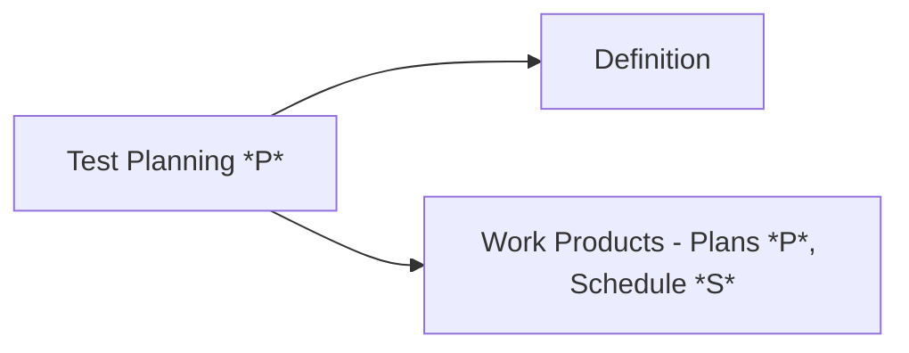
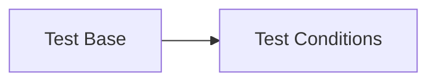
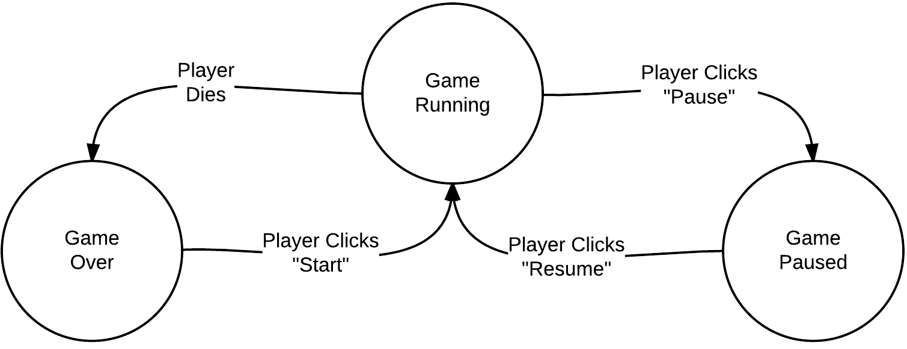

# Day 22 -  26/07/2022 - ISTQB Day 2

## Chapter 2: SDLC Continued.

https://www.saucedemo.com/

### System Testing

"Testing the whole system end-to-end" - Nish

Independent Testers

- Verifying whether the functional and non functional behaviours of the system are as designed and specified

- Validating ...

- GUI Tests (Selenium)
- Usability (Usefulness & Utility - How easy is it to navigate?)
- Exception Handling
- Scalability - How scalability
- Ad-Hoc - Random testing on the fly
- Installation - Does it install correctly
- Recovery?
- Security - MASSIVE category of testing
- Performance (about speed)
    - Stress (limits of the system, testing beyond the expected limits of the system)
    - Volume (data throughput)
    - Load (what is the number of users expected, can it meet that while loading at a good speed e.g. KPI is Home Screen load in 0.3s)

- Non-functional tests (Things users can't control, such as attributes of the system, e.g. Performance Tests) Functional testing (Anything to do with user input/output)

**Types of Testing are Content Dependent**

**You can't test eveything or use every test type** 
- Size of company
- Time available for test
- What resource are available (see budget)
- Learning Curve - how long will it take for the tester to learn the software that that the company uses?
- Budget

Test Objects
- The actual system under test

Test Basis (requirements & user manuals):
- Specifications, Risk analysis reports, Epics and user stories, manuals

**SWAGLABS for practicing testing**

- System appearance can't be automated - Manual Testing

Systems Testing - Does it work? (End-to-end behaviour of the system)
Acceptance Testing - Does it meet the user requirements? (customer journey)

### Acceptance Testing

- Testing against user expectations
- In Nish's head Systems and Acceptance Testing go hand in hand.

- Does this system meet all of the requirements?
- Ask self frequently
- Tests functional fitness of the system for business users
- NOTE: Acceptance Testing can take place before System Testing starts

#### Operational Acceptance Testing (Readiness)

Does it meet the requirements for going out into Operations
Additional environmental aspects to consider (backups, installation, disaster recovery procedures, end user training, etc.)

#### Contractual & Regulatory
- Contractual: Acceptance criteria outlined in a contract (typical of custom-developed software)
- Regulations: Governmental, Legal, Safety Reasons e.g. WCAG guidelines for a Council website (https://www.birmingham.gov.uk/accessibility).
Ignorance is not a defence

#### Alpha & Beta Testing
Alpha
: Performed at the developing site, but not by the developing team
: Development team controls hardware and setup
(User goes to dev site and tests alpha)

Beta
: Performed by customers at their own location

**Allows for feedback from potential or existing custoemrs**

Test Objects
- Systems under tests
- Forms
- Reports

Test Basis
- Use Cases
- System Requirements
- Business Processes

Typical Defects and Failures
- Not loading at the correct speed
- Navigating to the wrong page
- Not being able to do things the system is supposed to be doing (e.g. paying by PayPal)

**Each of the different test levels has different objects**

## Functional, non-functional & structural testing - Test Types

**Question: What test types can be done at each test level?
Answer: All test types can be done at all test levels**

Functional
: Specification Based (or requirement-based testing), Black-Box (test interfaces not implementation)

Non-Functional (Attributes of the system, -ilities of the system)
: Performance, Usability (often used to check the readiness of a system)

Structural
: Control flow, menu structure, White-Box (testing with knowledge of the code)

**ISTQB: White-Box testing can be performed at ALL testing levels. You can see the code under test.**

Change-Related
: Carried out on a live system

### Functional (Black-Box)

Testing the functions of system

- Risk Based Testing - Priority areas for users or revenue
- Business Process Based Testing - Day-to-day buesiness use

### Non-Functional

- Quality characteristics
    - -ilities (e.g. maintainability, scalability, compatibility (Different OSs))
    - Efficiency, Performance, Load, Stress

**ISTQB - Give us a scenario. What kind of testing is this?**

**Maintainability Testing - Its ability to maintain itself (get updates itself, install updates itself, backup files?)
Maintenance Testing - Is Change-Related Testing**

- Scalability - What changes would need to be made if a game was being ported to the Switch as opposed to PS5?

Device Fragmentation 
: Many different possible devices - Specify which ones the system will be tested on.
: For example: All phones, all OSs, all browsers

Structural (White Box)
- How code makes the functionality work
- What is happening 'under the hood'

- Decision coverage
- Statement coverage

## Change Related Testing: Confirmation, Regression and (CR) Maintenance Testing

### Confirmation Testing (Retesting)
- Find a defect
- Defect gets fixed
- Retest to confirm it is gone

### Regression Testing
- Check whole system
- Check if fixing a defect has broken anything else in the system
- USUALLY AGILE, USUALLY AUTOMATED
- Based on risk
- Performed at all levels

### Change Related Maintenance Testing
- **In a live environment**

- Modification
- Migration - From old to software
- Retirement of Software - Migrate data from and old system (e.g.)
- Planned upgrade to COTS-based (Off The Shelf) system
- Hotfixes - New faults in live that require fast fixes

- Impact analysis (Risk) and Metrics from previous projects are very important in this area. What are the resource requirements? (e.g. Budget)
- estimates amount of retesting and regression testing that needs to be done
    - What are the possible consequences?
    - What areas will remain unchanged?

**Remember you can view different parts of the syllabus based on the learning object stated in the question**

## Chapter 3 - Static Testing Techniques

Not executing any code

Dynamic Testing
: Testing software through execution

### Static Testing
Reviewing - testing code without execution - Reviewing documentation and requirements (sense check, ambiguities), static code analysis

#### Purpose
 
 'review objective' include:
 - Finding defects
 - Gaining understand
 - Generating discussion
 - Education
 - **Decision making by consensus**

##### What can be inspected?

- Anything that is involved in testing can be reviewed
- Anything that is in the SDLC can be reviewed

'Static Reviews' are just Meetings about testing

#### Review Levels of Formality
- Informal - Least formal - e.g. reading a document, pair programming
- Walkthrough - Checklist for what needs to be done in the meeting - **Enables learning** - Scribe is mandatory (minutes) - Led by Author of the document in the walkthrough - (from informal to formal)
- Technical Review - *Purpose* - **Gain consensus** - Led by facilitator/moderator - Scribe is mandatory - Prior preparation by individuals - (from informal to formal)
- Inspection - Most formal - *Purpose* - **find defects** - Lead by **trained facilitator/moderator** - Prior preparation is essential

**Key Differences WILL be a question***

#### Positions in a Review
Facilitator *
: Involved in every stage in the meeting process

Manager *
: Decide on process of review, and whether objectives have been met

Author
: ...of document being reviewed

Reviewers
: Specialised fault finding role (can be anyone, depends on meeting type)

Scribe
: Minutes - Documents all issues and points in the meeting

Review Leader
: Leads the review of the document - Plans and runs the review

Other
: Inspection/review co-ordinator

Review Leader (paperwork) - Follow-ups
vs.
Facilitator - (chairperson) - There to ensure nobody goes off topic, schedule is stuck to, eveyone has a chance to speak

Who makes the final decision? Manager
Who makes the notes? Scribe
Who was the "Author" in scenario X? e.g. BA

#### Review benefits (see more)
- Official decisions (fewer misunderstandings or ambiguities) (development productivity improvements, improved communication)
- Find defects earlier
- Reduces risks of defects (stops defects from escaping to higher test levels, or defects being baked into the code)

##### Activities in a Formal Review

1. Planning
    - Scope
    - Estimate effort and time
    - Plan roles
    - Select People
    - Define entry (Actions before review e.g. Docs going out) and exit criteria (DoD for completed review)
    - Checking entry criteria
2. Initiate Review
    - Distribute of work products - Facilitator
    - Explain
    - ...
3. Individual Review
    - Review the work products
    - Document defects, questions & comments
4. Issues communication and Analysis (ACTUAL MEETING)
    - Communicate potential defects
    - analyse defects
    - evaluate documents
    - evaluate result against exit criteria
5. Fixing and Reporting - Create defect reports, fix defects, record updated status of defects, gather metrics, check exit criteria (DoD)

PIIIF

#### Applying Review Techniques

Ad hoc - Reviewers given little/no guidance. Little preparation is required
Checklist-based - Systematic coverage of typical defects as effects detected based on checklist
Scenarios and dry runs - Reviewers get support materials to read work product
Role-Based - Reviewers evaluate the work product from the prespective of the individiual stakeholder roles (e.g. Test Cases from the perspective of the Test Author) (PRETENDING TO BE THE STAKEHOLDER)
Perspective-Based - Similar to role-based. But actually follow the processes outlined to create the output.

#### What might we find in a review?

60% of defects are found before coding has begun

Requirements & Test Plans - Ambiguous, Inaccurate, 
**Security Vulnerabilities**
Programming standards violations
Unreachable (dead) code
...

## Chapter 4 - Test Development and Design

Who are we testing for? Who are the end user? What are their skills going to be?

- The organisation, the maturity of the development and testing process, time/resource constraints, ...

### Test Design & Implementation
- Test Conditions
- Test Cases (AAA)
- Test Procedures

#### Test Conditions (e.g. 1. Login)

As a (user)
I want to (thing)
So that I can (result)

#### Test Case (e.g. 1.1 ..., 1.2 ...)

Test Cases have a set of input values(use Gherkin scripts to define them)
- Execution preconditions (Given)
    (when)
- Expected results (Then)
- Execution post-conditions (Results?)

"They are developed to cover a certain test objective or test condition"

#### Expected Results

- Results are produced as part of the specification of a test case
- ?

#### Test Oracle

A source to determine expected results to compare with the actual result of software under test. 

Examples: The existing system (for a benchmark), other software, user manual, individual's specialised knowledge

#### Test Procedures

Step-by-steps

#### Traceability

"The degree to which a relationship can be established...?"

Are you testing something that is high priority?

- Describing progress in terms of requirements that have been specified has a lot more meaning (and impact) with stakeholders than purely numerical measures of progress.

#### Scheduling

"In what order are we going to execute our test cases?"

- Highest priority tests run first
- (dependencies for high priority tasks)
- Regression tests are always run last.

#### Test Coverage

"Quantitative measures are exteremly important to help stakeholders to understand how much of the system has been tested."

### Types of testing

#### Functional
- If they give the correct input - Do they get the right output

#### Non-Functional
- All of the other things that go into the product - the attributes (performance, the -ilities)

#### Structural
-

#### Change-related
- Regression testing, ..

### Dyanmic Testing Techniques

#### White-Box Testing

#### Black-Box Testing (specification-based, requirements-based, functional)
##### Smoke Check - Critical functionality is working before testing new features
##### Sanity Check - ...?

##### Decision Table Testing - Table - Conditions (bool) vs. Action
- Combination of conditions selects a specific action
- Each column is a Test Case
- The Actions are our Expected Results
WILL GET A K-3 QUESTION ON A DECISION TABLE
- **Note: Decisions tables are open to interpretation**

.

Infeasible - Certain conditions are logically impossible, can still test to ensure that they ARE impossible

##### State Transition Testing
"When a system is represented as being in one state and transitions from that state to another"

Each transation can be its own TestCase, or we can link transitions to make other Test Cases.

- States, Transitions, Inputs or Events, Actions

- Draw state transition diagram
- Determine start state, input, output, and finish state
- (Determine coverage level to be achieved)
- Draw testing tree (state transition table)
- Define tests

##### Equivalence Partitioning
##### Boundary Value Analysis
##### Use Case Testing

#### Experience-Based Testing
- Exploratory Testing
