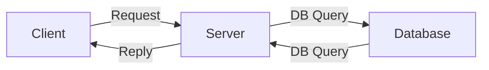

# Day 27 - 02/08/2022 - 

[TOC]

## Stand-up

Pillars of OOP
- Abstraction - Classes as a blueprint
- Encapsulation - Data hiding
- Inheritance - "Is a" relationship, e.g. Jon Crofts `is a` Human
- Polymorphism - Greek for many forms - Examples are method overriding (override inherited virtual methods), and method overloading

SOLID Principles
- Take advantage of OO languages to make sure code is...
    - more maintainable
    - easy to refactor

Liskov relates to Polymorphism
- Principle of least surprise
- Base types should be substitutable for derived types and vice versa

Manual Testers or Automated Testability (They compliment one another)
- Usability testing
- Accessibility testing
- Getting the user experience

- Its a lot to automate particular pathways
- Good for short paths
- Easier and Cheaper to Manual Test
- Automation - Most used paths, high risk paths (regession tests)
- Then manual tests can explore - Overcome the Pesticide paradox

Functional vs. Non-Functional
- Functional Testing (Black-Box Testing) - Expected output vs. Actual output, no knowledge of the code are needed
- Non-Functioanl Testing - Speed, Memory management
(White-Box - Unit Testing, Mocks, Stubs - Knowledge of code)

## Nullable Reference and Nullable Value Types

https://docs.microsoft.com/en-us/dotnet/csharp/language-reference/builtin-types/nullable-value-types

### Default values
- `bool` - `false`
- numerical types (`int` etc.) - `0`
- `string` - `null` (string is a reference type so is on the stack but has no assigned memory address)

For nullable types
- `int? a` is now `null`
- `Nullable<int> a`
As a default value may be misleading for a value that is unset, e.g. Age `0` has a meaning, whereas Age `null` makes it clear that it is unset.

https://docs.microsoft.com/en-us/dotnet/csharp/nullable-references

## Serialisation

Add `[Serializable]` tag above the class declaration

## Asynchronous Programming

Threading
: Different Execution Paths (e.g. Two people do two different things side by side)

Asynchronous Programming
: One thread (e.g. One person does another thing while waiting for the first thing to finish)

[MICROSOFT DOCS: Task asynchronous programming model](https://docs.microsoft.com/en-us/dotnet/csharp/programming-guide/concepts/async/task-asynchronous-programming-model)

- `await` 
    - Wait for this task to be complete...
    - ... while waiting go back to the caller method

[All web applications (ASP.NET) have all async methods]

As we declare methods `aysnc` we have to work back up the method call tree making sure that things will fire at the right time

[==PRACTICE With Async Tasks==]
- Method name conventions `____Async()`
- `async` and `await` keywords

## API Testing

Colloquially
- API - Web APIs

API
: Two applications talking to each other

Who is communicating?

Server
- Holds information

Client
- Requests information
- Or asks for it to be created, updated, or deleted

Client sends a request to the server and receives a response

==Ask more about caching API data when we get to API testing==

Client doesn't know about the Server it knows about API
Server doesn't know about the Client it knows about API

HTTP is also used by API

URI vs URL

POSTman

HTTP response codes

CRUD
: Create, Read, Update, Delete

### RESTful APIs (others are SOAP)
https://restfulapi.net/rest-architectural-constraints/
- A bunch of standards for an API to make it "RESTful"
- Representational State Transfer
- Architectural Style for an API

#### 1. Uniform Interface
- Our response should contain links to other resources

- Identify a resource - using and URI
    - The "R" (Representational) part of REST - Naming resources is key
    - query parameters (`?`)
        - Can chair quern parameters
    - path parameters
    - ==CONVENTIONS EXISTS==

- A client with a given resource has enough information to manipulate the resource through a representation
- Self-descriptive messages
- **HATEOS** - **H**ypermedia **A**s **T**he **E**ngine **O**f **S**tate
    - Hyper media is text (links) that takes you to other media
    - So can navigate through objects to other related resources

Representation and Data Flow
- A representation that can be pased between Client and Server that can be understood by both (e.g. JSON, XML, plain text)

HTTP Headers
- Extra information about the Request and Response that the client makes
- GET requests have no body in most instances
- Key-Value pairs

| HTTP - Request Structure |
|-|-|-|
| Verb | Usage | Info |

| HTTP - Response Structure |
|-|

#### 2. Client-server
- Requests to a server from a client using HTTP

#### 3. 

### Caching

Storage of results and using the results in subsequent requests

Can be done
- Client
- Server
- Database (?)

Headers can be used to control caching

Download Postman
Create an account
Follow Youtube Tutorials
Explore Postman

## Intro to Postman

### Part 1: Send a Request

New API request
- Type of request in left (defaults to `GET`)
- API URL
- Send request
- Look at JSON in Body
- Look at Status Code

Query Parameters
- Can specify query parameters (Use Query Params section)
- Post query keyword in "KEY" (added to address automatically)
- Post query value in "VALUE" field
- Use checkboxes to enable and disable parameters
- Delete using the "x" at the end on hover

Saving Requests
- Save Button
- Cannot save requests on their own - MUST add to a collection
- Collections can have folders added using the context menu on the collection

Collections and Workspaces
- Collections are saved in Workspaces
- New workspaces can be added through the "Workspaces" toolbar menu item

Mistakes 
- Write query parameters EXACTLY as they are in the API documentation (it is case-sensitive
- Empty brackets just means an empty list, if the status is 200 that means the response is just empty