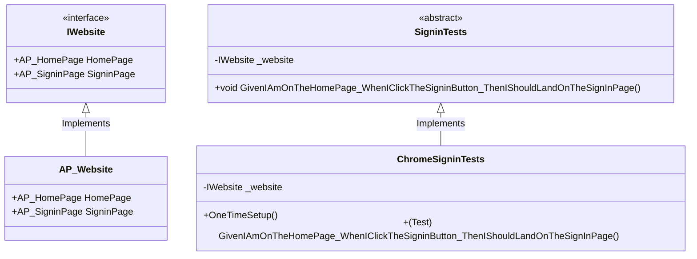

# Generic Test Construction

```mermaid
classDiagram
    class IWebsite
    IWebsite : +AP_HomePage HomePage
    IWebsite : +AP_SigninPage SigninPage
    <<interface>> IWebsite

    class AP_Website
    IWebsite <|-- AP_Website : Implements
    AP_Website : +AP_HomePage HomePage
    AP_Website : +AP_SigninPage SigninPage
    
    class SigninTests
    <<abstract>> SigninTests
    SigninTests : -IWebsite _website
    SigninTests : +void GivenIAmOnTheHomePage_WhenIClickTheSigninButton_ThenIShouldLandOnTheSignInPage()

    class ChromeSigninTests
    SigninTests <|-- ChromeSigninTests : Implements
    ChromeSigninTests : -IWebsite _website
    ChromeSigninTests : +OneTimeSetup()
    ChromeSigninTests : +(Test) GivenIAmOnTheHomePage_WhenIClickTheSigninButton_ThenIShouldLandOnTheSignInPage()

```