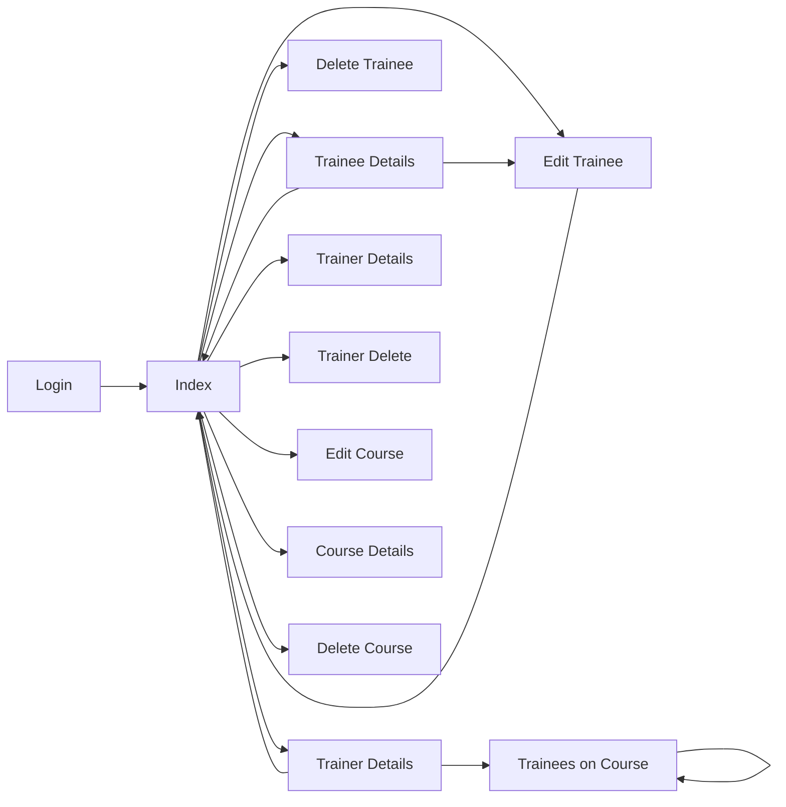

# Pathing

Filters
index --> trainees
index --> trainers
index --> courses
index --> account

Click on a tab twice and it hides -> Can end up with empty page (Indicators)

Edit Trainee: Return to index link breaks page
Details: Back to list breaks index page
Courses 
